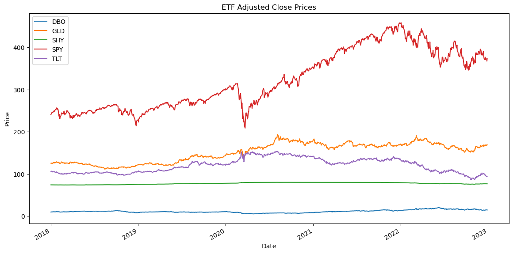
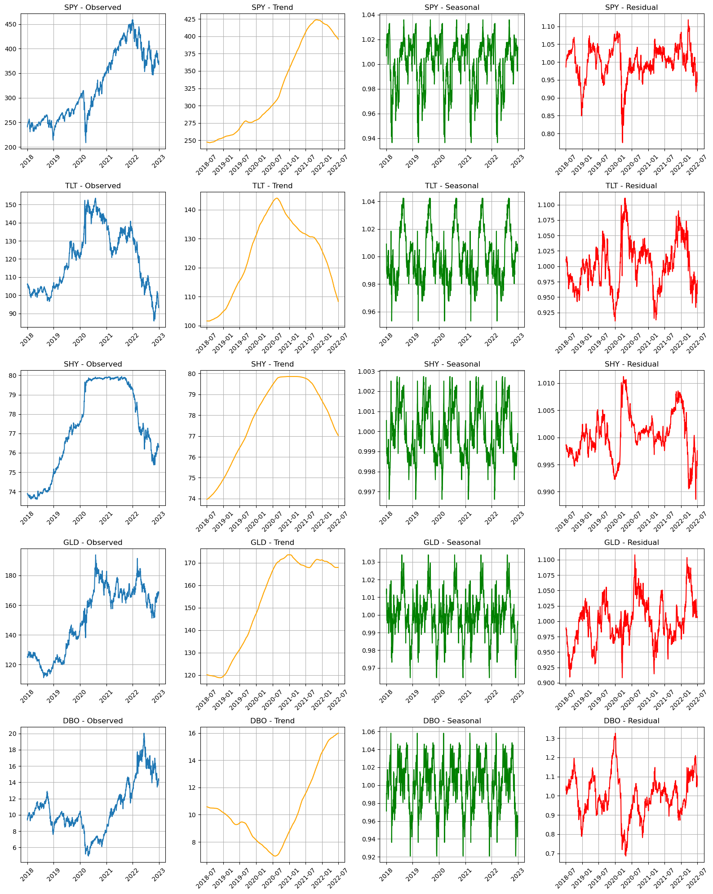
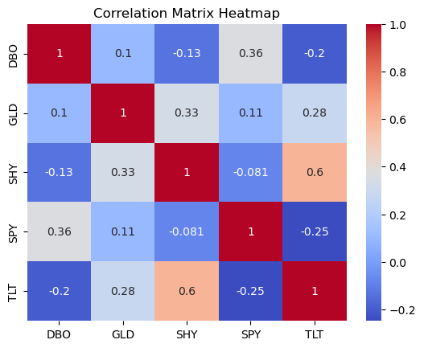
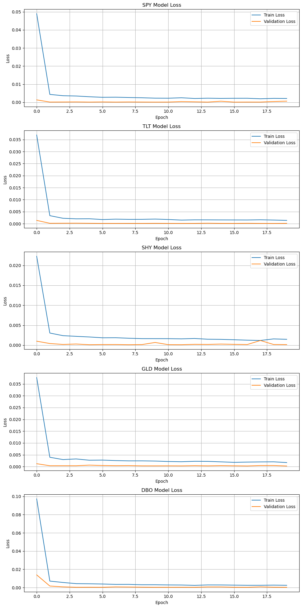
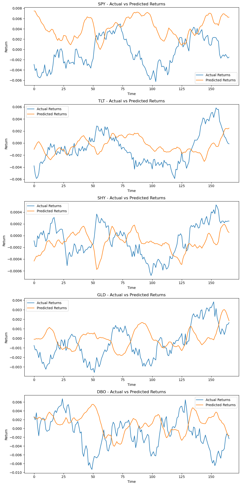
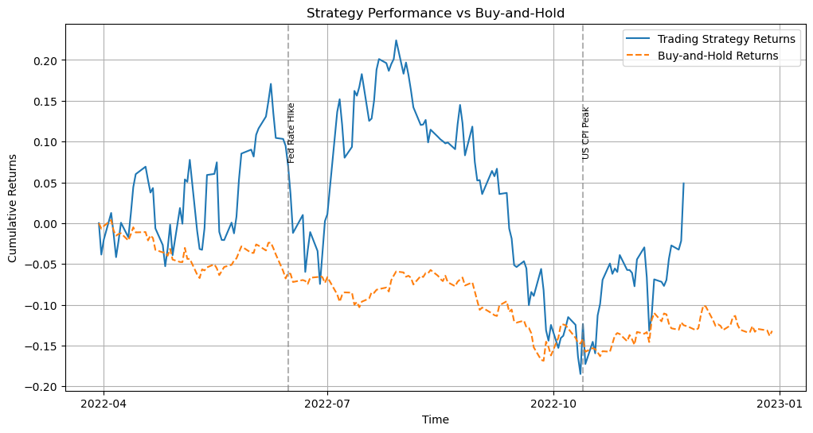
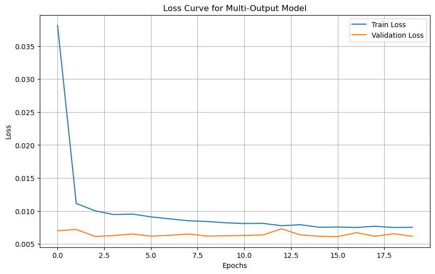
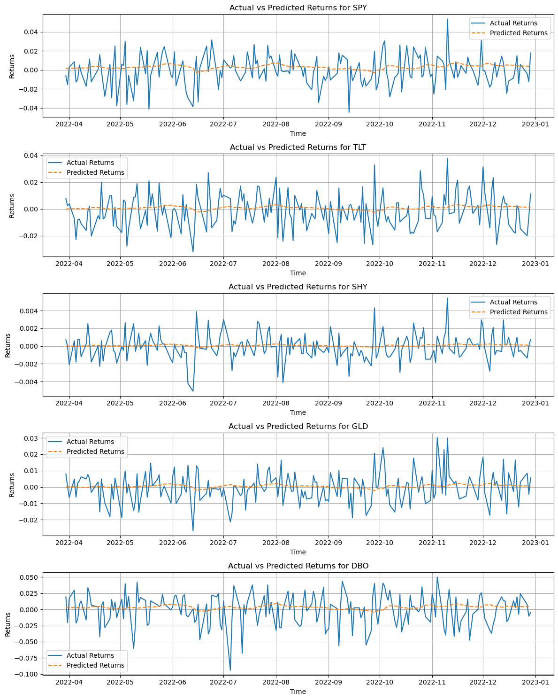
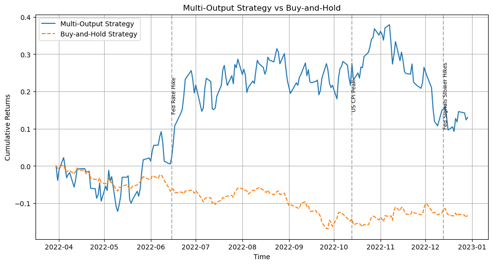

# **Multi-Asset LSTM Trading Strategies: Single vs. Multi-Output Model Performance**

### **Introduction**  

This report explores the use of Deep Learning, specifically Long Short-Term Memory (LSTM) models, to predict short-term market trends across various asset classes. Using predictions from the models, we develop and backtest trading strategies, comparing their performance against a buy-and-hold strategy.  

The analysis covers five ETFs:  
- **Equity** → SPDR S&P500 ETF (`SPY`)  
- **Fixed Income** → iShares 20+ Year Treasury Bond ETF (`TLT`)  
- **Cash-like** → iShares 1-3 Year Treasury Bond ETF (`SHY`)  
- **Precious Metals (Gold)** → SPDR Gold Shares (`GLD`)  
- **Crude Oil** → Invesco DB Oil Fund (`DBO`)  

---

### **Step 1: Data Gathering and Exploration**  

#### **1.1 Data Collection**  

Daily adjusted close prices for the ETFs were gathered from January 1, 2018, to December 30, 2022, using the `yfinance` library. The data was cleaned and prepared for analysis, with log returns calculated to capture percentage price changes.  

#### **1.2 Exploratory Data Analysis**  

- **Adjusted Close Prices**: Trends in ETF prices revealed distinct dynamics across asset classes.  
  

- **Seasonal Decomposition**: Trend, seasonal, and residual components provided insights into price behaviors.  
  

- **Correlation and Summary Statistics**:  
  - Pair plots and heatmaps indicated correlations between ETFs.  
  - Stationarity was confirmed using the Augmented Dickey-Fuller (ADF) test.  
    

---

### **Step 2: Single-Output LSTM Models**  

#### **2.1 Model Development**  

For each ETF, a single-output LSTM model was developed to predict 25-day ahead average returns. Each model consisted of:  
- Two stacked LSTM layers  
- Dropout layers to prevent overfitting  
- A dense output layer  

Training used time-series data split into training (70%), validation (15%), and test (15%) sets, with a time step of 25 days.  

#### **2.2 Model Performance**  

- **Loss Curves**: Training and validation loss curves showed effective convergence.  
  

- **Actual vs. Predicted Returns**: Models accurately captured return dynamics for individual ETFs.  
  

- **Performance Metrics**:  
  - **SPY**: MSE = 0.000038, MAE = 0.0051  
  - **TLT**: MSE = 0.000009, MAE = 0.0025  
  - **SHY**: MSE = 0.000000, MAE = 0.0003  
  - **GLD**: MSE = 0.000005, MAE = 0.0019  
  - **DBO**: MSE = 0.000029, MAE = 0.0042  

#### **2.3 Trading Strategy**  

A trading strategy was implemented:  
- **Long** the top 2 ETFs with the highest predicted returns.  
- **Short** the bottom 2 ETFs with the lowest predicted returns.  
- Rebalancing every 25 days.  

**Backtest Results**:  
  

- **Strategy Metrics**:  
  - Sharpe Ratio = 0.15  
  - Maximum Drawdown = -40.89%  

- **Buy-and-Hold Metrics**:  
  - Sharpe Ratio = -1.35  
  - Maximum Drawdown = -17.24%  

---

### **Step 3: Multi-Output LSTM Model**  

#### **3.1 Model Development**  

A multi-output LSTM model was developed to simultaneously predict 25-day ahead returns for all ETFs. The model architecture included:  
- Two stacked LSTM layers with 100 units each.  
- Dropout layers for regularization.  
- A dense output layer with five units (one per ETF).  

#### **3.2 Model Performance**  

- **Loss Curves**:  
    

- **Actual vs. Predicted Returns**:  
  The multi-output model captured ETF return dynamics effectively.  
    

- **Performance Metrics**:  
  - MSE = 0.000228  
  - MAE = 0.010360  

#### **3.3 Multi-Output Trading Strategy**  

The trading strategy for the multi-output model mirrored Step 2.  
  

---

### **Step 4: Discussion and Insights**  

#### **4.1 Predictability Implications**  

- **Single-Output Models**:  
  - Each model focused on a single ETF, leveraging specific patterns unique to that asset.  
  - Achieved high accuracy for individual ETFs but required separate training and evaluation.  

- **Multi-Output Model**:  
  - Combined patterns across all ETFs, capturing cross-asset relationships.  
  - Reduced training complexity and improved efficiency, but slightly higher MAE suggests potential trade-offs in precision for individual predictions.  

#### **4.2 Differences in Backtesting Performance**  

- **Single-Output Strategy**:  
  - Outperformed the buy-and-hold strategy in cumulative returns and Sharpe Ratio.  
  - Higher drawdown indicates higher risk exposure.  

- **Multi-Output Strategy**:  
  - Outperformed both the single-output strategy and buy-and-hold strategy in cumulative returns.  
  - Lower drawdown and smoother performance suggest better risk-adjusted returns.  

#### **4.3 Insights on Captured Information**  

- **Single-Output Models**: Focused on short-term patterns specific to each ETF, limiting their ability to exploit inter-ETF relationships.  
- **Multi-Output Model**: Integrated information across ETFs, leveraging correlations to enhance predictions and reduce noise.  

---
